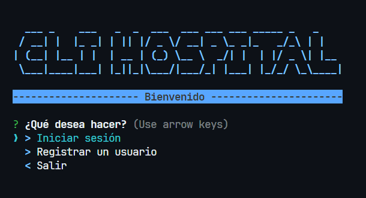
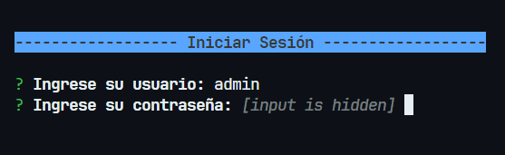
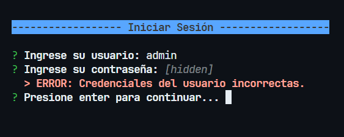
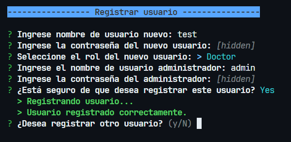
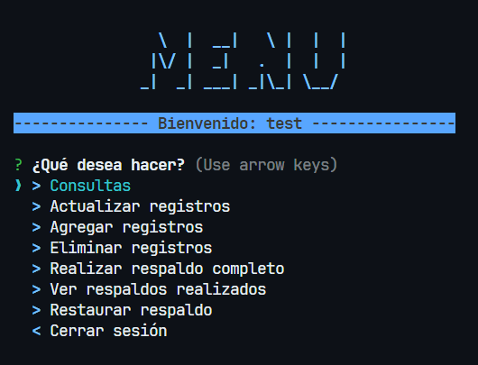
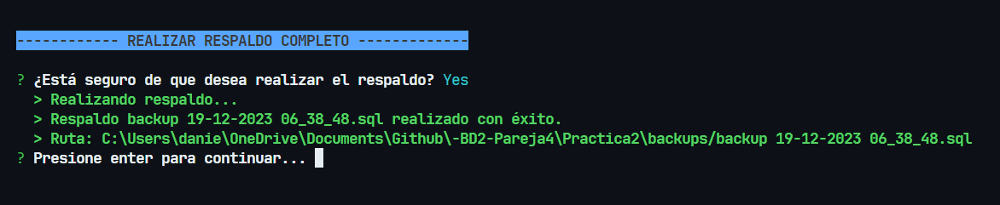
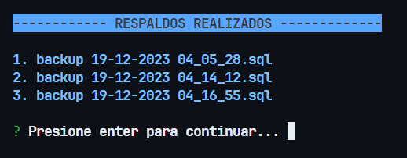
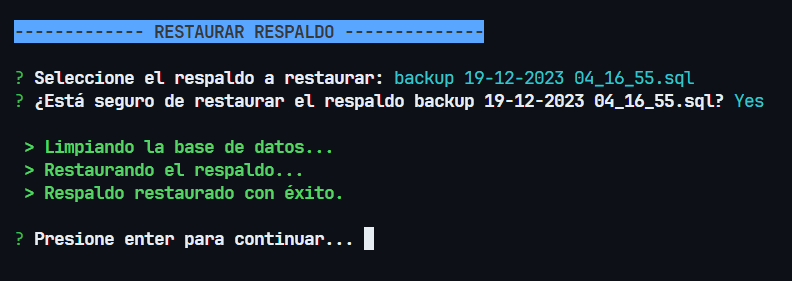

# 📑 MANUAL DE USUARIO [BD2]Practica2_Pareja4

```bash
Universidad de San Carlos de Guatemala
Facultad de Ingeniería
Escuela de Ciencias y Sistemas
Sistemas de bases de datos 2 - Sección N
Ing. Marlon Francisco Orellana
Aux. Edin Emanuel Montenegro Vásquez

Carné: 201901772
Nombre: Daniel Reginaldo Dubón Rodríguez

Carné: 202004745
Nombre: Allen Giankarlo Román Vásquez

```
# 🏥 CLI Hospital

El hospital, que previamente contrató sus servicios como ingeniero en sistemas para la 
migración a bases de datos y la implementación de un sistema de backups, ha planteado 
nuevos requisitos para fortalecer aún más la seguridad y la gestión de su base de datos. 
Ahora se busca la capacidad de realizar backups desde una Interfaz de Línea de Comandos 
(CLI), ofreciendo una solución más ágil y eficiente.

En este contexto, se espera que la CLI no solo permita la ejecución de backups, sino que 
también posibilite la creación y gestión de roles para los diversos empleados en el hospital. 
Además, se incorporará la funcionalidad de restauración de los backups creados, 
proporcionando una solución completa y autosuficiente para el ciclo de vida de los datos.

Un componente crucial de esta mejora será la implementación de un sistema de registro 
exhaustivo, donde cada acción y evento relacionado con la base de datos quede registrado 
de manera precisa en una bitácora. Este registro no solo servirá como una herramienta 
esencial para la identificación y resolución de problemas, sino que también actuará como una 
capa adicional de seguridad, garantizando la integridad de la información.

La importancia de estas mejoras radica en el amplio personal del hospital, donde la gestión 
precisa y segura de los datos es esencial. La capacidad de crear roles específicos asegurará 
que cada empleado acceda únicamente a la información pertinente a su función, brindando 
no solo seguridad, sino también una estructura organizativa más eficiente y controlada.


# 🛠️ Tecnologías utilizadas
* NodeJS v18.17.0
  * bcrypt v5.0.1
  * chalk v4.1.2
  * clear v0.1.0
  * dotenv v10.0.0
  * inquirer v8.1.2
  * mysql2 v2.3.0

  
* MySQL
  * Server version: 8.0.34 MySQL Community Server

# 🚀 Instalación y configuración

Antes de iniciar con la instalación y configuración de la aplicación, se debe tener instalado NodeJS y MySQL en el equipo, aca hay una guía de instalación de cada uno de ellos.

## Instalación de MySQL
- Descargar el instalador de MySQL desde el siguiente enlace: https://dev.mysql.com/downloads/installer/
- Ejecutar el instalador y seguir los pasos de instalación.

## Instalación de NodeJS
- Descargar el instalador de NodeJS desde el siguiente enlace: https://nodejs.org/es/download/
- Ejecutar el instalador y seguir los pasos de instalación.
- Verificar la instalación de NodeJS ejecutando el siguiente comando en la terminal:
```bash
node --version
```

## ⚙️ Configuración de MySQL
Debe tener instalado MySQL en su equipo, si no lo tiene instalado, siga los pasos de la sección anterior.

- Con una herramienta de administración de MySQL, como MySQL Workbench, ejecutar el script de creación de la base de datos, el cual se encuentra en la siguiente ruta: [`db.sql`](./scripts/db.sql)
- También ejecutar el script de creación de los triggers, el cual se encuentra en la siguiente ruta: [`triggers.sql`](./scripts/triggers.sql)
- Ejecutar el script de la creacion de roles, el cual se encuentra en la siguiente ruta: [`roles.sql`](./scripts/roles.sql)
- Ejecutar el script de la creacion de usuarios, el cual se encuentra en la siguiente ruta: [`users.sql`](./scripts/users.sql)

## 👨‍💻 Ejecución de la aplicación
Para poder debe ubicarse en la carpeta raíz del proyecto y ejecutar el siguiente comando:
```bash
npm install
```
Esto instalará todas las dependencias necesarias para la ejecución de la aplicación.

Para ejecutar la aplicación debe ejecutar el siguiente comando:
```bash
npm start
```
Esto iniciará la aplicación y le mostrará el menú principal.

## 💻 Uso de la aplicación

### 📌 Pantalla incial

<div align="center"></div>

Esta pantalla es la primera que se muestra al iniciar la aplicación, para poder escoger una opcion debe moverse con las flechas de arriba y abajo, cuenta con las siguientes opciones:

- **Iniciar sesión:** Permite iniciar sesión en la aplicación, para esto se debe ingresar el usuario y la contraseña.

- **Registrarse:** Permite registrarse en la aplicación, para esto se debe ingresar el usuario, la contraseña, seleccionar el rol, posteriormente debe ingresar las credenciales del usuario administrador para poder crear el usuario.

- **Salir:** Permite salir de la aplicación.

### 📌 Pantalla de inicio de sesión

<div align="center"></div>

Esta pantalla es la que se muestra al seleccionar la opción de iniciar sesión en la pantalla inicial, para poder iniciar sesión se debe ingresar el usuario y la contraseña, si las credenciales son correctas se mostrará el menú principal.

Si las credenciales son incorrectas se mostrará un mensaje de error y se volverá a mostrar la pantalla de inicio de sesión.

<div align="center"></div>

### 📌 Pantalla de registro

<div align="center"></div>

Esta pantalla es la que se muestra al seleccionar la opción de registrarse en la pantalla inicial, para poder registrarse se debe ingresar el usuario, la contraseña, seleccionar el rol, posteriormente debe ingresar las credenciales del usuario administrador para poder crear el usuario.

Si las credenciales del usuario administrador son incorrectas se mostrará un mensaje de error y se volverá a mostrar la pantalla de registro.

Entre los roles que se pueden seleccionar se encuentran:

- **Asistente:** Este rol tiene los siguientes privilegios:
  - SELECT en la tabla habitación.
  - SELECT y UPDATE en la tabla paciente.

- **Doctor:** Este rol tiene los siguientes privilegios:
  - SELECT en la tabla paciente
  
- **Soporte:** Este rol tiene los siguientes privilegios:
  - SELECT, UPDATE e INSERT en la tabla log_actividad.
  - SELECT, UPDATE e INSERT en la tabla log_habitacion.

- **Administrador:** Este rol tiene todos los privilegios de acciones como SELECT, UPDATE, INSERT, DELETE en todas las tablas de la base de datos, tambien puede realizar backups y restaurar backups y es el unico que puede crear usuarios.  Este rol no se puede seleccionar en la pantalla de registro, solo se puede seleccionar en la pantalla de creación de usuarios.

### 📌 Pantalla Menú principal

<div align="center"></div>

Esta pantalla mostrara el menú principal de la aplicación, en este menú se pueden realizar las siguientes acciones:

- **Consultas:** Permite realizar consultas a la base de datos, para esto se debe seleccionar la opción de consultas y posteriormente se mostrará un submenú con las opciones de consultas que se pueden realizar.

- **Actualizar registros:** Permite actualizar registros de la base de datos, para esto se debe seleccionar la opción de actualizar registros y posteriormente se mostrará un submenú con las opciones de actualización de registros que se pueden realizar.

- **Agregar registros:** Permite crear registros en la base de datos, para esto se debe seleccionar la opción de crear registros y posteriormente se mostrará un submenú con las opciones de creación de registros que se pueden realizar.

- **Eliminar registros:** Permite eliminar registros de la base de datos, para esto se debe seleccionar la opción de eliminar registros y posteriormente se mostrará un submenú con las opciones de eliminación de registros que se pueden realizar.

- **Realizar respaldo:** Permite realizar un respaldo de la base de datos, para esto se debe seleccionar la opción de realizar respaldo y posteriormente se mostrará un submenú con las opciones de respaldo que se pueden realizar.

- **Ver respaldos:** Permite ver los respaldos de la base de datos, para esto se debe seleccionar la opción de ver respaldos y posteriormente se mostrará un submenú con las opciones de ver respaldos que se pueden realizar.

- **Restaurar respaldo:** Permite restaurar un respaldo de la base de datos, para esto se debe seleccionar la opción de restaurar respaldo y posteriormente se mostrará un submenú con las opciones de restauración de respaldo que se pueden realizar.

### 📌 Pantalla de consultas

### 📌 Pantalla de actualización de registros

### 📌 Pantalla de creación de registros

### 📌 Pantalla de eliminación de registros

### 📌 Pantalla de respaldos


<div align="center"></div>

Para esta opcion solo el usuario administrador puede realizar respaldos, le preguntara si desea realizar el respaldo, si selecciona que si procedera a realizar un backup de la base de datos completo y le mostrara un mensaje de que el respaldo se realizo correctamente.

### 📌 Pantalla de ver respaldos

<div align="center"></div>

Esta opcion solo el usuario administrador puede ver los respaldos, le mostrara un listado de los respaldos que se han realizado, si selecciona un respaldo le mostrara las tablas que contiene ese respaldo.

### 📌 Pantalla de restauración de respaldos

<div align="center"></div>

Esta opcion solo el usuario administrador puede restaurar respaldos, debera seleccionar el respaldo que desea restaurar y le preguntara si desea restaurar el respaldo, si selecciona que si procedera a restaurar el respaldo y le mostrara un mensaje de que el respaldo se restauro correctamente.